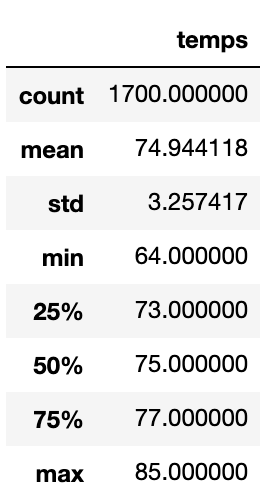
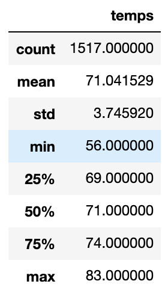

# surfs_up
Use SQLAlchemy to query from SQLite temperature data for the months of June and December in Oahu (Hawaii), in order to determine if the surf and ice cream shop business is sustainable year-round. Building webpages with Flask to hold the result, so that the board of directors will be able to easily access the analysis. 
<a href = "https://github.com/angelnga/surfs_up/blob/main/app.py"> app.py </a>
## Overview
Using Python, Pandas functions and methods, and SQLAlchemy to filter the date column of the Measurements table in the hawaii.sqlite database to retrieve all the temperatures for the month of June and December. Then convert those temperatures to a list, create a DataFrame from the list, and generate the summary statistics.
  
## Result
- Deliverable 1: Determine the Summary Statistics for June 
  
   
  
- Deliverable 2: Determine the Summary Statistics for December 
  
   
  1. December has less record counts(1517) than in June(1700)
  2. The minimum and maximum range in December(56-83F) is larger than in June(64-85F)
  3. Average temperature in December is 3.9F lower than in June

## Summary 

Based on the result above, June has a slightly warmer and more constant range of temperature than in December. But the different is not big that would effect to open an ice-cream and surffing business in Oahu. 

1. To invest more details in exact shop open locations at Oahu, a rainfall and temperature plot graph in lsland's latitude and longtitude would help to avoid opening a store at the rainy side of the island. 
2. I might also check on other months data during the year for 3 years to make sure there's not a big change or 08-2016 to 08-2017 is the only good year compare to others. 
